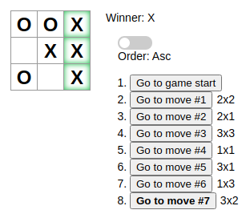

# Tic-Tac-Toe

# Sobre
Jogo da velha da [documentação](https://pt-br.reactjs.org/tutorial/tutorial.html) do React

# Iniciando
## Pré-requisitos
- `npm >= 6.14.5`

- `react >= 15.3.1`

## Instalação

- ### 1. Clonar o repositório
    `git clone https://github.com/felipenaf/tic-tac-toe`

- ### 2. Instalar o npm

    [Nesse link](https://www.npmjs.com/get-npm)

- ### 3. Executar o projeto

    `npm start`

    Obs. esse comando deve ser executado na raiz do projeto

# Extras
## Desafios Propostos
 - [x] Mostrar a localização de cada jogada no formato (col,row), para cada jogada no histórico.
 - [x] Estilizar com negrito o item da lista de jogadas que está selecionado no momento.
 - [x] Reescrever o componente Board para utilizar 2 loops para fazer os quadrados, em vez de deixá-los hardcoded.
 - [x] Adicionar um botão de toggle que lhe permita ordenar as jogadas em ordem ascendente ou descendente.
 - [x] Quando alguém ganhar, destaque os 3 quadrados que causaram a vitória.
 - [x] Quando ninguém ganhar, exiba uma mensagem informando que o resultado foi um empate.

